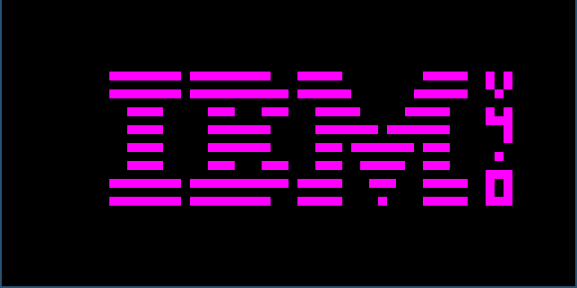
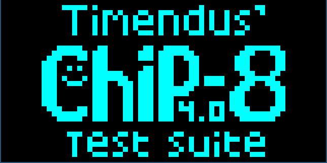

# Cip8
my implementation of the chip8 emulator in C.       
like htf that i dont know about chip8 there is tons of resoures to making a emulator for dang it, but this one is me trying to do it by my self without youtube. i hope itwerks.


**This project is Done,** there are definitely bugs but it was a great learning exp, maybe i comeback and remake it ;).   

## Links
[wiki page](https://en.wikipedia.org/wiki/CHIP-8)    
[tests](https://github.com/Timendus/chip8-test-suite#ibm-logo)


## How To Run
```
    $ ./run
```

## Screenshots


